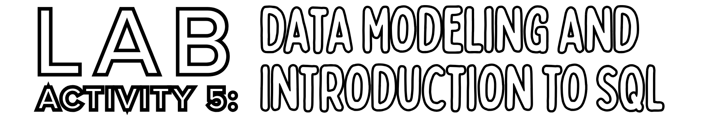
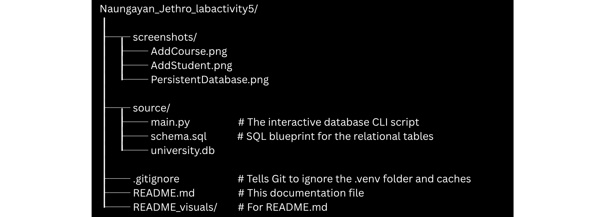
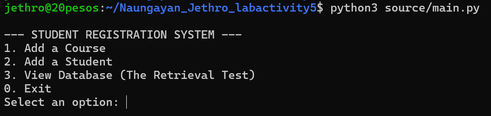
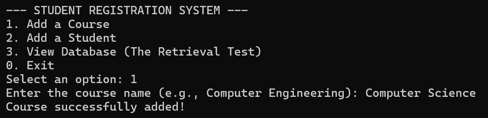
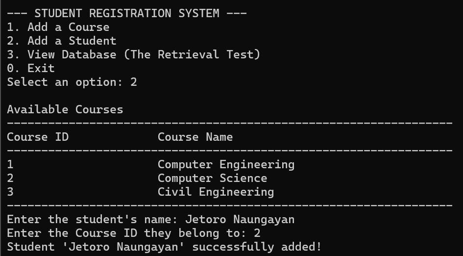

> **Note:** Parts of this documentation were assisted by AI to help ensure correctness.

**Author:** Jethro C. Naungayan

**Professor:** Dr. John De Guzman Tarampi

**Course & Block:** CPE106L-4_B1

## Overview

This repository reports the completion of Lab Activity 5. The activity focused on designing a small relational model and implementing it using SQL statements for table creation, insertion, and retrieval. To demonstrate these concepts, a Student Registration System that can store information that persists was developed using Python's `sqlite3` library, allowing for manual data entry and relational database querying.

This README specifically explains how to run the activity.

## Prerequisites & Technologies

This activity was done on Windows. To run this project, you will need the following tools and services:

* **Operating System:** Windows Subsystem for Linux (WSL) running Ubuntu
* **Language:** Python 3
* **Environment Management:** `venv` (Python Virtual Environment)
* **Version Control:** Git & GitHub

## Project Structure

Here is how the files are organized within this repository:



## How to Run the Activity (for Windows Users)

Open Windows PowerShell and run the following commands:

### 1. Enter Linux Environment
```powershell
wsl   # Switches your terminal to your Ubuntu terminal
cd ~  # Brings you to the Linux main user folder
```

### 2. Clone the Repository
```bash
git clone https://github.com/20pesos/Naungayan_Jethro_labactivity5  # Downloads a copy of the repository
cd Naungayan_Jethro_labactivity5                                    # Enters the folder of the copy
```

### 3. Create and Activate a Virtual Environment
Because virtual environments are not tracked by Git, you must create a new one locally and activate it.
```bash
python3 -m venv .venv
source .venv/bin/activate
```
*(You will know it is active when your terminal line starts with `(.venv)`).*

### 4. Run the Main Program
Execute the main script to initialize the database and open the interactive menu:
```bash
python3 source/main.py
```

Running the code above will display an interactive menu.



You can add courses.



You can add students with the courses you made earlier.


And you can display all the students' information. You can close the program, and you'll still be able to see the information from previous sessions.



### 5. Deactivate the Environment
When you are done testing the application, exit the virtual environment by typing in your Windows PowerShell:
```bash
deactivate
```
